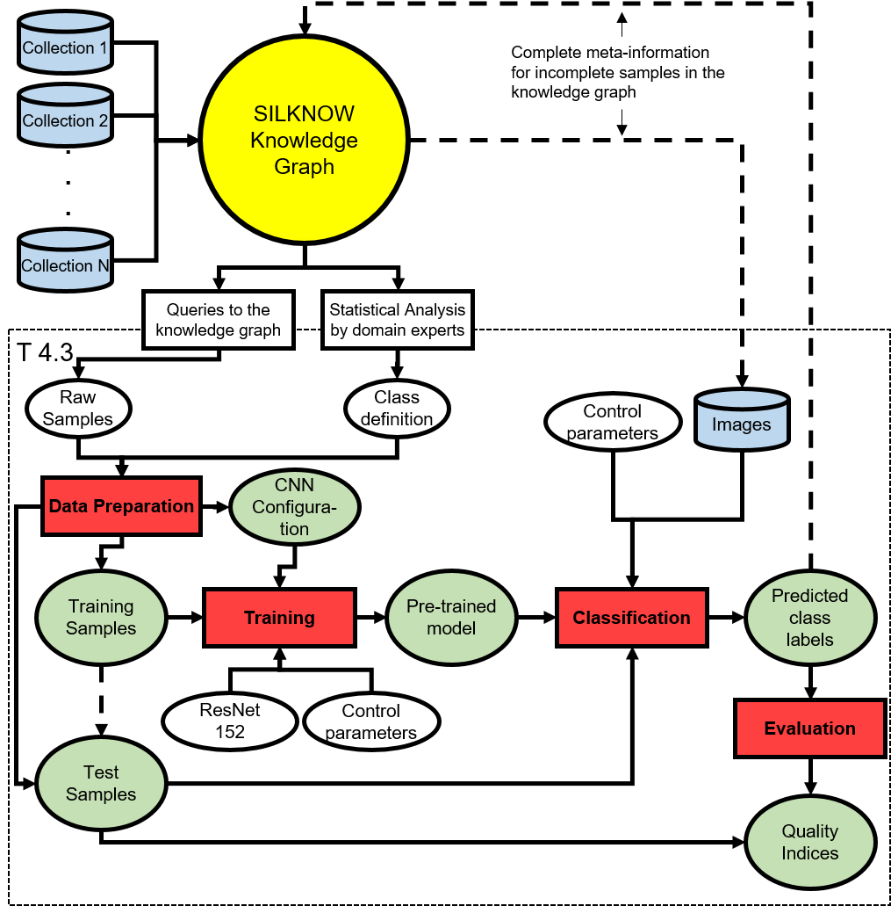

.. SILKNOW Image Classification Toolbox documentation master file, created by
   sphinx-quickstart on Wed Jul 17 11:09:06 2019.
   You can adapt this file completely to your liking, but it should at least
   contain the root `toctree` directive.

Welcome to SILKNOW Image Classification Toolbox's documentation!
========================================

.. toctree::
   :maxdepth: 3
   
***************************** 
Overview of the documentation
*****************************
This software provides python functions for the classification of images and training and evaluation of classification models. It consists of five main parts: The creation of a dataset, the training of a new classifier, the evaluation of an existing classifier, the classification of images using an existing classifier and the combined training and evaluation in a five-fold cross validation. All functions take configuration files as an input and generally write their results in specified paths. The format required for the configuration files is described in Deliverable D4.4.

The requirements for the silknow_image_classification toolbox are python 3.7.4 and the following python packages\:
	- opencv-python
	- numpy
	- urllib3
	- pandas
	- tqdm
	- tensorflow (1.13.1)
	- tensorflow-hub (0.6.0)
	- matplotlib
	- sklearn
    - xlrd

****************************
SILKNOW Image Classification
****************************

====================================
silknow_image_classification Toolbox
====================================

All functions in the image classification package as well as a short description of them are listed in the following table. Afterwards, the operating principle of each function is explained and the respective input and output parameters are described.

+-----------------------------------------+---------------------------------------------+
| **Name of the function**                | **Short description of the function**       |
+=========================================+=============================================+
| CreateDataset                           | Creates a dataset with samples for the      |
|                                         | training and evaluation (Data Preparation). |
+-----------------------------------------+---------------------------------------------+
| train_CNN_Classifier                    | Trains a new classification model.          |
|                                         | (Training)                                  |
+-----------------------------------------+---------------------------------------------+
| evaluate_CNN_Classifier                 | Evaluates an existing classification model. |
|                                         | (Evaluation)                                |
+-----------------------------------------+---------------------------------------------+
| crossvalidate_CNN_Classifier            | Trains and evaluates a new model using      |
|                                         | cross validation.                           |
+-----------------------------------------+---------------------------------------------+
| apply_CNN_Classifier                    | Classifies images using an existing         |
|                                         | classification model. (Classification)      |
+-----------------------------------------+---------------------------------------------+

Process flow of the image processing module and its embedding in the context of SILKNOW.

   
   Process flow of the SILKNOW image classification module and its embedding in the context of SILKNOW.

.. automodule:: silknow_image_classification
	:members: